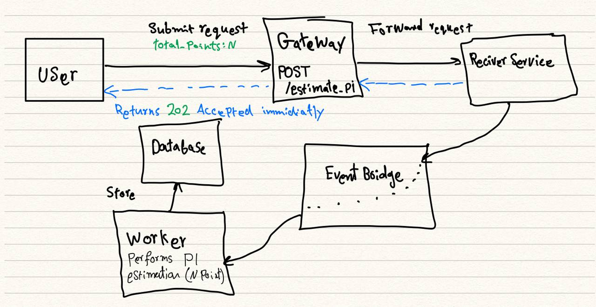
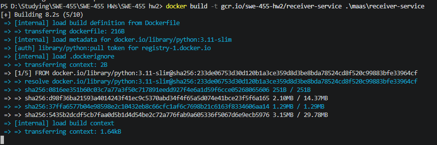
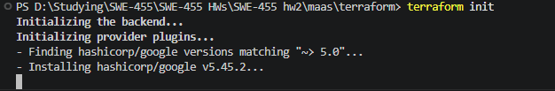
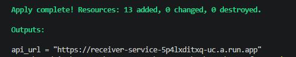
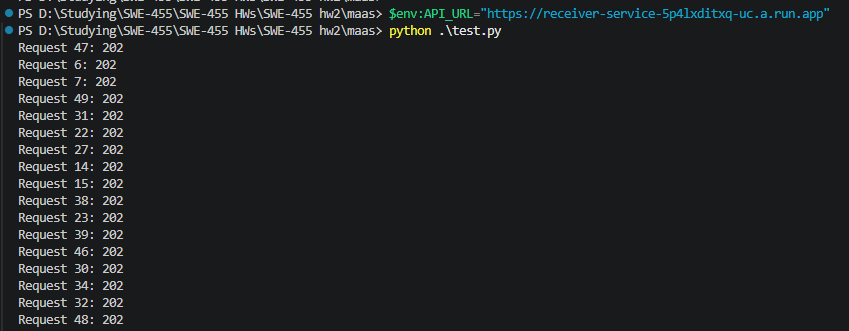
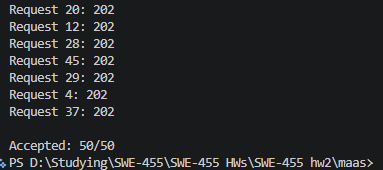
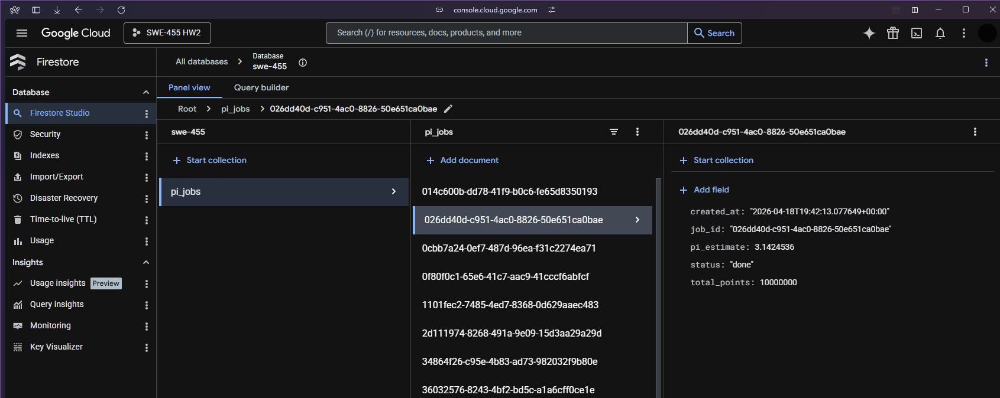

# Math as a Service

This is my SWE 455 homework project. The receiver service gets `POST /estimate_pi`, sends the job to Pub/Sub, and the worker service calculates pi with Monte Carlo simulation and saves the result in Firestore.

## Files

```text
maas/
  README.md
  test.py
  receiver-service/
    app.py
    Dockerfile
    requirements.txt
  worker-service/
    worker.py
    Dockerfile
    requirements.txt
  terraform/
    main.tf
  screenshots/
    architecture.jpg
    01-terraform-init.png
    02-docker-image.png
    03-terraform-apply-done.png
    04-test-request.png
    05-firestore-result.png
    06-load-test-50-accepted.png
```

## Run

```powershell
gcloud auth login
gcloud auth application-default login
gcloud config set project YOUR_PROJECT_ID
gcloud services enable run.googleapis.com pubsub.googleapis.com firestore.googleapis.com containerregistry.googleapis.com
gcloud auth configure-docker

docker build -t gcr.io/YOUR_PROJECT_ID/receiver-service .\maas\receiver-service
docker build -t gcr.io/YOUR_PROJECT_ID/worker-service .\maas\worker-service

docker push gcr.io/YOUR_PROJECT_ID/receiver-service
docker push gcr.io/YOUR_PROJECT_ID/worker-service

cd .\maas\terraform
terraform init
terraform apply `
  -var="project_id=YOUR_PROJECT_ID" `
  -var="region=us-central1" `
  -var="receiver_image=gcr.io/YOUR_PROJECT_ID/receiver-service" `
  -var="worker_image=gcr.io/YOUR_PROJECT_ID/worker-service"
```

## Test

```powershell
cd .\maas
$env:API_URL="https://YOUR_RECEIVER_URL"
python .\test.py
```

## Screenshots Included

- `architecture.jpg`
- `01-terraform-init.png`
- `02-docker-image.png`
- `03-terraform-apply-done.png`
- `04-test-request.png`
- `05-firestore-result.png`
- `06-load-test-50-accepted.png`

## Short Report

This project is a simple event-driven backend for estimating pi. The receiver service accepts the request and returns `202 Accepted` immediately, then Pub/Sub sends the job to the worker service. The worker runs the Monte Carlo simulation and stores the result in Firestore in the `pi_jobs` collection. I tested the project with concurrent requests and the system accepted the requests successfully.

## Screenshots

1. Architecture:



2. Docker image



3. Terraform init:




4. Terraform apply done



5. Test request




6. Load test result



7. Firestore result

